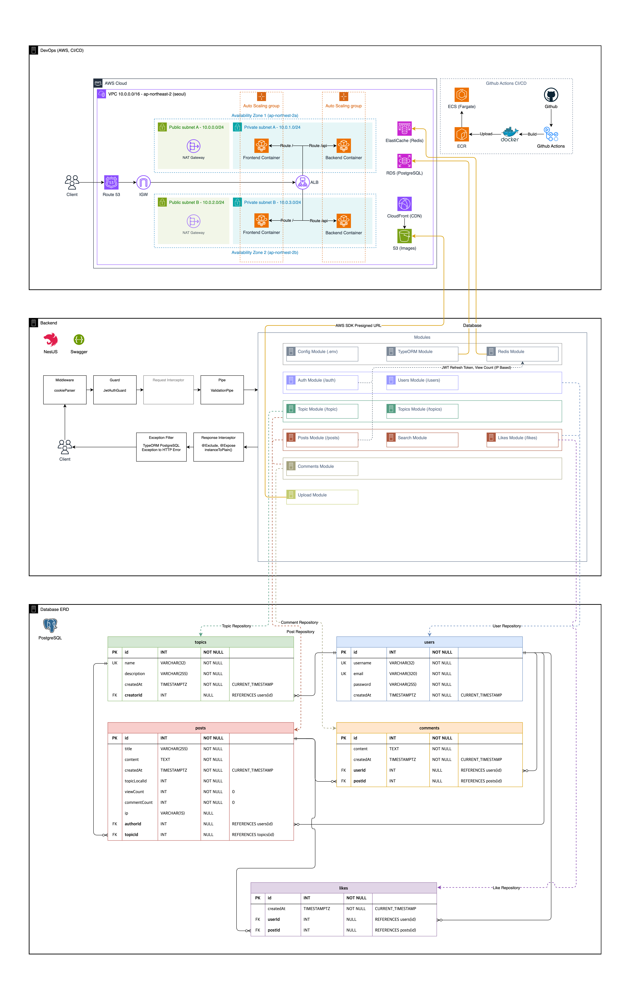

# 0725 Project

## [프로젝트 문서 (Notion)](https://scythe-snowplow-4f2.notion.site/0725-Community-Forum-Project-23b7c27c3ffb80f09bafc79a8d187d5b)

<a href="https://scythe-snowplow-4f2.notion.site/0725-Community-Forum-Project-23b7c27c3ffb80f09bafc79a8d187d5b" target="_blank">
  
</a>

> [!IMPORTANT]
> 프로젝트의 구조, 개발 현황 및 기타 정보를 확인하려면 위의 Notion 링크를 클릭하세요.



# Source Code Tree

```
./backend/src
├── app.controller.ts
├── app.module.ts
├── common
│   ├── constants
│   │   └── index.ts
│   ├── dto
│   │   ├── base.dto.ts
│   │   ├── index.ts
│   │   └── pagination.dto.ts
│   ├── filters
│   │   └── typeorm-exception.filter.ts
│   ├── guards
│   │   └── jwt-auth.guard.ts
│   ├── interceptors
│   │   └── transform.interceptor.ts
│   ├── redis
│   │   ├── index.ts
│   │   ├── redis.module.ts
│   │   └── redis.service.ts
│   ├── types
│   │   └── express-request.interface.ts
│   └── utils
│       └── setupSwagger.ts
├── main.ts
├── migrations
│   ├── 1754101626596-Init.ts
│   ├── 1754386946982-Init.ts
│   ├── 1754387093530-Init.ts
│   ├── 1754401128588-Init.ts
│   └── 1754545150879-Init.ts
└── modules
    ├── auth
    │   ├── auth.controller.ts
    │   ├── auth.module.ts
    │   ├── auth.service.ts
    │   ├── dto
    │   │   ├── base.dto.ts
    │   │   ├── index.ts
    │   │   ├── request.dto.ts
    │   │   └── response.dto.ts
    │   └── jwt.strategy.ts
    ├── comments
    │   ├── comments.controller.ts
    │   ├── comments.entity.ts
    │   ├── comments.module.ts
    │   ├── comments.service.ts
    │   └── dto
    │       ├── base.dto.ts
    │       ├── index.ts
    │       ├── request.dto.ts
    │       └── response.dto.ts
    ├── likes
    │   ├── dto
    │   │   ├── index.ts
    │   │   └── response.dto.ts
    │   ├── likes.controller.ts
    │   ├── likes.entity.ts
    │   ├── likes.module.ts
    │   └── likes.service.ts
    ├── posts
    │   ├── dto
    │   │   ├── base.dto.ts
    │   │   ├── index.ts
    │   │   ├── request.dto.ts
    │   │   └── response.dto.ts
    │   ├── posts.controller.ts
    │   ├── posts.entity.ts
    │   ├── posts.module.ts
    │   └── posts.service.ts
    ├── topic
    │   ├── dto
    │   │   ├── index.ts
    │   │   ├── request.dto.ts
    │   │   └── response.dto.ts
    │   ├── topic.controller.ts
    │   ├── topic.module.ts
    │   └── topic.service.ts
    ├── topics
    │   ├── dto
    │   │   ├── base.dto.ts
    │   │   ├── index.ts
    │   │   ├── request.dto.ts
    │   │   └── response.dto.ts
    │   ├── topics.controller.ts
    │   ├── topics.entity.ts
    │   ├── topics.module.ts
    │   └── topics.service.ts
    ├── upload
    │   ├── dto
    │   │   ├── index.ts
    │   │   ├── request.dto.ts
    │   │   └── response.dto.ts
    │   ├── upload.controller.ts
    │   ├── upload.module.ts
    │   └── upload.service.ts
    └── users
        ├── dto
        │   ├── base.dto.ts
        │   ├── index.ts
        │   └── response.dto.ts
        ├── users.controller.ts
        ├── users.entity.ts
        ├── users.module.ts
        └── users.service.ts
./frontend/src
├── api
│   ├── auth.ts
│   ├── client.ts
│   ├── comments.ts
│   ├── likes.ts
│   ├── posts.ts
│   ├── topics.ts
│   ├── types.ts
│   └── users.ts
├── app
│   ├── components
│   │   ├── AllPosts
│   │   │   ├── index.tsx
│   │   │   └── PostCard.tsx
│   │   ├── Auth
│   │   │   ├── AuthForm.tsx
│   │   │   ├── AuthModal.tsx
│   │   │   ├── LoginForm.tsx
│   │   │   └── RegisterForm.tsx
│   │   ├── Header.tsx
│   │   ├── LeftSidebar
│   │   │   ├── index.tsx
│   │   │   ├── LeftSidebarItems.tsx
│   │   │   └── SidebarSection.tsx
│   │   ├── Main
│   │   │   ├── index.tsx
│   │   │   ├── PostCard.tsx
│   │   │   └── PostCarousel.tsx
│   │   ├── PageLayout.tsx
│   │   ├── Pagination
│   │   │   └── index.tsx
│   │   ├── Post
│   │   │   ├── Comments.tsx
│   │   │   └── index.tsx
│   │   ├── RightSidebar
│   │   │   ├── CommentItem.tsx
│   │   │   └── index.tsx
│   │   ├── Topics
│   │   │   └── index.tsx
│   │   ├── TopicsDetail
│   │   │   ├── index.tsx
│   │   │   └── TopicPostCard.tsx
│   │   └── UserMenu.tsx
│   ├── context
│   │   ├── AuthContext.tsx
│   │   └── SidebarContext.tsx
│   ├── favicon.ico
│   ├── globals.css
│   ├── hooks
│   │   ├── useAccordion.ts
│   │   ├── useForm.ts
│   │   └── useIsMobile.ts
│   ├── layout.tsx
│   ├── page.tsx
│   ├── posts
│   │   └── page.tsx
│   ├── profile
│   │   └── page.tsx
│   ├── ReactQueryProvider.tsx
│   └── topics
│       ├── [topic]
│       │   ├── [topiclocalid]
│       │   │   └── page.tsx
│       │   └── page.tsx
│       └── page.tsx
└── utils
    ├── dateFormatter.ts
    ├── getAnchorHref.ts
    └── getClosestAllowedValue.ts

49 directories, 126 files
```
